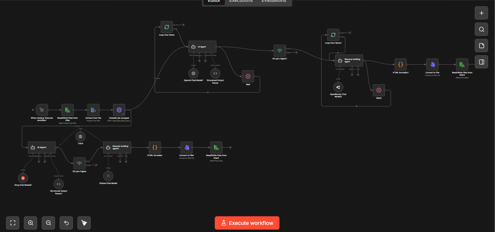
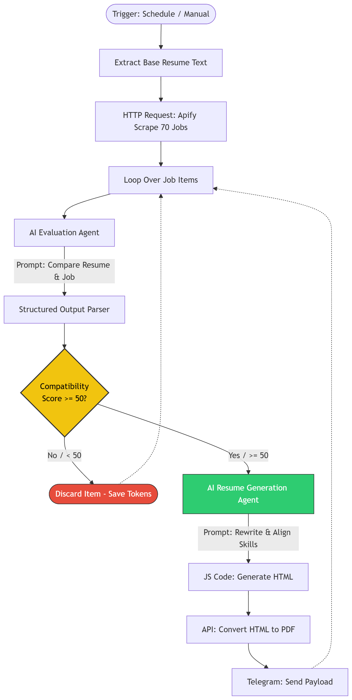
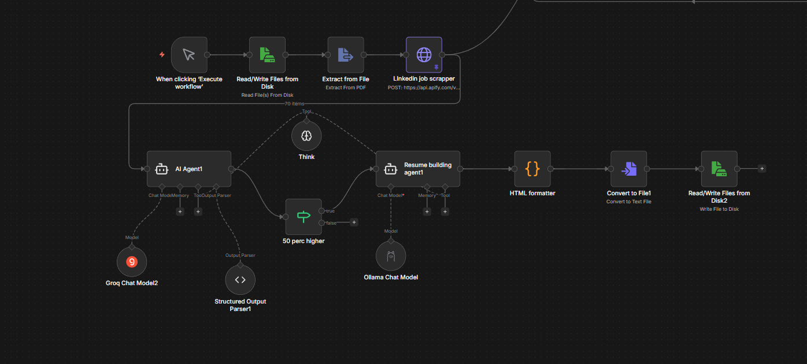

# 🚀 AI-Powered Job Matching & Resume Optimization System

[](https://n8n.io/)
[](#)
[](#)
[](#)

A multi-agent AI pipeline that automates job discovery, evaluates candidate-job compatibility, and generates tailored resumes dynamically using a hybrid LLM architecture.

## 🚀 Overview



This project is an end-to-end intelligent system designed to streamline the job application process by combining:
* Automated job scraping
* AI-driven candidate-job matching
* Dynamic resume generation
* Real-time delivery via a messaging interface

The system leverages a multi-agent architecture orchestrated through n8n workflows, enabling modular, scalable, and cost-efficient AI operations.

---

## 🧩 Architecture



The system is composed of multiple specialized agents working in sequence:

* **🔍 Scraper Agent:** Extracts job listings from LinkedIn using external APIs (Apify) and collects structured job data (company, description, metadata).
* **🧠 Evaluation Agent:** Uses LLMs to analyze job descriptions, scores the compatibility between the candidate's base profile and the job posting, and outputs a structured evaluation in JSON format.
* **⚖️ Filtering Layer:** Applies decision logic (e.g., compatibility score ≥ 50%) to immediately filter out irrelevant opportunities.
* **📝 Resume Generation Agent:** Generates highly tailored resumes based on job requirements, aligning the candidate's experience with the specific job description.
* **🎨 Formatting Engine:** Converts structured resume data from `JSON → HTML`, and then `HTML → PDF`, applying consistent styling and layout.
* **📤 Delivery Layer:** Sends the generated, tailored resumes (both HTML and PDF versions) directly to the user via a Telegram bot.

---

## 🤖 Hybrid AI Strategy



To optimize performance and drastically reduce operational API costs, the system implements a **Hybrid LLM approach**:
* **Lightweight/Local Models:** Used for simple, repetitive, or high-volume tasks (like initial bulk filtering).
* **Reasoning Models:** More powerful, commercial models are reserved strictly for complex reasoning tasks (like the final resume tailoring).
* **Intelligent Routing:** Dynamically routes tasks between models based on the required output structure and context window.

---

## 🛠️ Tech Stack

**Languages & Orchestration**
* TypeScript / JavaScript
* Node.js
* n8n (Workflow Orchestration)

**AI / LLM Integration**
* Multi-model architecture (OpenAI, Groq, OpenRouter, Local Models)
* LangChain & Structured output parsing

**Automation & APIs**
* Apify API (LinkedIn job scraping)
* HTTP integrations & Webhooks

**Document Processing**
* JSON → HTML → PDF conversion pipeline

**DevOps & Delivery**
* Docker & Docker Compose (Full local deployment)
* Telegram Bot API

---

## 🐳 Deployment

The entire system is fully containerized using Docker. To run it locally:

```bash
# Clone the repository
git clone [https://github.com/yahyass22/Multi-agent-AI-pipeline.git](https://github.com/yahyass22/Multi-agent-AI-pipeline.git)
cd Multi-agent-AI-pipeline

# Start the environment
docker-compose up -d
